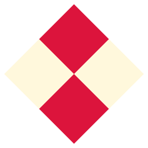

# Savage Examples

This page provides a few examples showcasing the capabilities of the **savage** Python package for programmatic SVG generation.

Each example includes a short description, the code used to generate the SVG, and the resulting output.

---

## Example 1: Basic Shapes

Demonstration of basic SVG shape elements supported by the savage package. Includes `circle`, `rect` (with optional rounded corners), `ellilpse`, `line`, `polyline` (open) and `polygon` (closed) with labels done via `text` element.


<details>
<summary>python script</summary>

```Python
from savage import Graphic, Circle, Rect, Ellipse, Line, Polygon, Polyline, Text

g = Graphic(width=670, height=120, background="white")
g.add(Circle(cx=60,cy=60,r=50))
g.add(Text(x=60, y=60, content="circle"))
g.add(Rect(width=100, height=80, x=120, y=20, rx=10, ry=10))
g.add(Text(x=170, y=60, content="rect"))
g.add(Ellipse(cx=280, cy=60, rx=50, ry=40))
g.add(Text(x=280, y=60, content="ellipse"))
g.add(Line(x1=340, y1=110, x2=440, y2=10))
g.add(Text(x=390, y=60, content="line"))
g.add(Polyline(points=[450,110, 450,10, 550,10]))
g.add(Text(x=500, y=60, content="polyline"))
g.add(Polygon(points=[560,110, 660,110, 660,10]))
g.add(Text(x=610, y=60, content="polygon"))

g.save("output.svg")
```
</details>

<details>
<summary>svg output</summary>

```xml
<?xml version="1.0" encoding="UTF-8" standalone="no"?>
<svg xmlns="http://www.w3.org/2000/svg" width="670" height="120">
  <style>
    circle, ellipse, line, polygon, polyline, rect {
      fill: #EBF3F7;
      stroke: #9CA7AD;
      stroke-width: 2;
    }
    text { font-family: sans-serif; text-anchor: middle; dominant-baseline: middle; fill: #40484D; }
  </style>
  <rect width="100%" height="100%" style="fill: white;" />
  <circle cx="60" cy="60" r="50" />
  <text x="60" y="60">circle</text>
  <rect width="100" height="80" x="120" y="20" rx="10" ry="10" />
  <text x="170" y="60">rect</text>
  <ellipse cx="280" cy="60" rx="50" ry="40" />
  <text x="280" y="60">ellipse</text>
  <line x1="340" y1="110" x2="440" y2="10" />
  <text x="390" y="60">line</text>
  <polyline points="450,110 450,10 550,10" />
  <text x="500" y="60">polyline</text>
  <polygon points="560,110 660,110 660,10" />
  <text x="610" y="60">polygon</text>
</svg>
```
</details>

---

## Example 2: Styling – Fill, Stroke, and Stroke Width

This example highlights how different styling attributes can be applied to SVG elements using the `savage` package.

- A circle with a **custom fill color** (`cornsilk`)
- A circle with a **colored stroke** (`red`)
- A circle with an **increased stroke width** (`4` units)


<details>
<summary>python script</summary>

```Python
from savage import Graphic, Circle, Text

g = Graphic(width=340, height=120, background="white")
g.add( Circle(cx=60, cy=60, r=50, fill="cornsilk") )
g.add( Text(x=60, y=60, content="fill") )
g.add( Circle(cx=170, cy=60, r=50, stroke="red") )
g.add( Text(x=170, y=60, content="stroke") )
g.add( Circle(cx=280, cy=60, r=50, strokewidth=4) )
g.add( Text(x=280, y=60, content="stroke-width") )

g.save("output.svg")
```
</details>

<details>
<summary>svg output</summary>

```xml
<?xml version="1.0" encoding="UTF-8" standalone="no"?>
<svg xmlns="http://www.w3.org/2000/svg" width="340" height="120">
  <style>
    circle {
      fill: #EBF3F7;
      stroke: #9CA7AD;
      stroke-width: 2;
    }
    text { font-family: sans-serif; text-anchor: middle; dominant-baseline: middle; fill: #40484D; }
  </style>
  <rect width="100%" height="100%" style="fill: white;" />
  <circle cx="60" cy="60" r="50" style="fill: cornsilk;" />
  <text x="60" y="60">fill</text>
  <circle cx="170" cy="60" r="50" style="stroke: red;" />
  <text x="170" y="60">stroke</text>
  <circle cx="280" cy="60" r="50" style="stroke-width: 4;" />
  <text x="280" y="60">stroke-width</text>
</svg>
```
</details>

---

## Example 3: Groups and Transformations

This example showcases how grouping and transformations work in the `savage` package. Groups allow multiple elements to be manipulated as a single unit. In this case:

- Four squares are arranged into a larger square.
- The group is **rotated** by 45 degrees around the origin.
- That rotated group is then **translated** (moved) to the center of the canvas.



<details>
<summary>python script</summary>

```Python
from savage import Graphic, Rect, Group

g = Graphic(width=300, height=300)

rotated_group = Group()
rotated_group.add( Rect( x=0, y=-100, width=100, height=100, fill="cornsilk", stroke="none") )
rotated_group.add( Rect( x=-100, y=0, width=100, height=100, fill="cornsilk", stroke="none") )
rotated_group.add( Rect( x=-100, y=-100, width=100, height=100, fill="crimson", stroke="none") )
rotated_group.add( Rect( x=0, y=0, width=100, height=100, fill="crimson", stroke="none") )
rotated_group.rotate(45)

translated_group = Group()
translated_group.add( rotated_group )
translated_group.translate(dx=150, dy=150)

g.add(translated_group)

g.save("output.svg")
```
</details>

<details>
<summary>svg output</summary>

```xml
<?xml version="1.0" encoding="UTF-8" standalone="no"?>
<svg xmlns="http://www.w3.org/2000/svg" width="300" height="300">
  <g transform="translate(150,150)">
  <g transform="rotate(45)">
  <rect width="100" height="100" x="0" y="-100" style="fill: cornsilk; stroke: none;" />
  <rect width="100" height="100" x="-100" y="0" style="fill: cornsilk; stroke: none;" />
  <rect width="100" height="100" x="-100" y="-100" style="fill: crimson; stroke: none;" />
  <rect width="100" height="100" x="0" y="0" style="fill: crimson; stroke: none;" />
</g>
</g>
</svg>
```
</details>