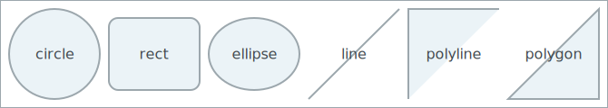

# Savage Examples

This page provides a few examples showcasing the capabilities of the **savage** Python package for programmatic SVG generation.

Each example includes a short description, the code used to generate the SVG, and the resulting output.

---

## Example 1: Basic Circle

A simple red circle with a black stroke.

``` Python
from savage import Circle, Graphic

g = Graphic()
c = Circle(cx=50, cy=50, r=40, fill="red", stroke="black", strokewidth=2)
g.add(c)
g.save("examples/example_1/output.svg")
```



---

## Example 2: Transformed Rectangle

A rectangle that has been rotated and translated using transformation chaining.

``` Python
from savage import Rectangle, Graphic

g = Graphic()
r = Rectangle(x=10, y=10, width=80, height=40, fill="blue", stroke="black")
r.rotate(30).translate(20, 10)
g.add(r)
g.save("examples/transformed_rectangle.svg")
```


---

## Example 3: Polygon and Polyline

A polygon and a polyline created from a list of points.

``` Python
from savage import Polygon, Polyline, Graphic

g = Graphic()
p = Polygon(points=[10, 10, 60, 10, 35, 50], fill="lime", stroke="green")
l = Polyline(points=[10, 60, 30, 80, 50, 60], stroke="black", strokewidth=2)
g.add(p)
g.add(l)
g.save("examples/polygon_polyline.svg")
```


---

## Example 4: Styled Text

Text with custom font, color, and alignment.

``` Python
from savage import Text, Graphic

g = Graphic()
t = Text(x=10, y=40, content="Hello, SVG!", fill="black", fontfamily="Courier", anchor="start")
g.add(t)
g.save("examples/text.svg")
```


---

## Example 5: Combined Graphic

Multiple shapes and text combined into one graphic.

``` Python
from savage import Circle, Rectangle, Text, Graphic

g = Graphic()

g.add(Circle(cx=30, cy=30, r=20, fill="yellow"))
g.add(Rectangle(x=60, y=20, width=40, height=20, fill="skyblue"))
g.add(Text(x=10, y=80, content="Shapes!", fill="black", fontfamily="Verdana"))

g.save("examples/combined.svg")
```


---

These are just a few examples — the `savage` library is designed to be flexible, composable, and lightweight for use in creative and scientific projects alike.
